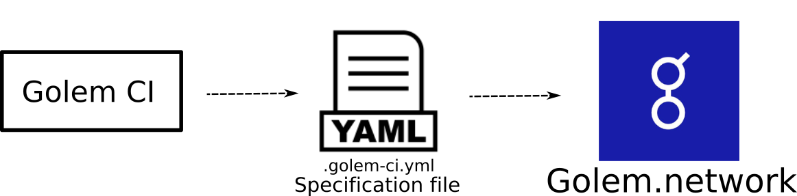

# Golem CI
Decentralized Task pipline on top of Golem.network.
[](https://github.com/hhio618/golem-ci "Golem CI")

## Demo video
[](https://youtu.be/cy_xFz5VVWs "Golem ci")

## Features
+ Easy way to submit tasks to Golem.network.
+ Collect task logs.
+ 

## Quickstart
### Install yagna
```$ sh curl -sSf https://join.golem.network/as-requestor | bash -```
### Install the cli
Run the following command to install the CLI:
```console
pip install golem-ci
```  
Check installed version:
```console
golem_ci --version
```
### Run yagna daemon
```sh
$ yagna service run
```

### Run some example 
```sh
$ cd example/hello_world
$ export YAGNA_APPKEY=<your-key> 
$ # or
$ golem_ci set-api-key <your-key> 
$ # then
$ golem_ci up .
Using context directory: hello_world
....
```
See [example](example) for more info.  
To create your own golem image see [Convert a Docker image into a Golem image](https://handbook.golem.network/requestor-tutorials/convert-a-docker-image-into-a-golem-image) 

## Build using docker
```sh
$ docker build -t golem-ci:latest
```